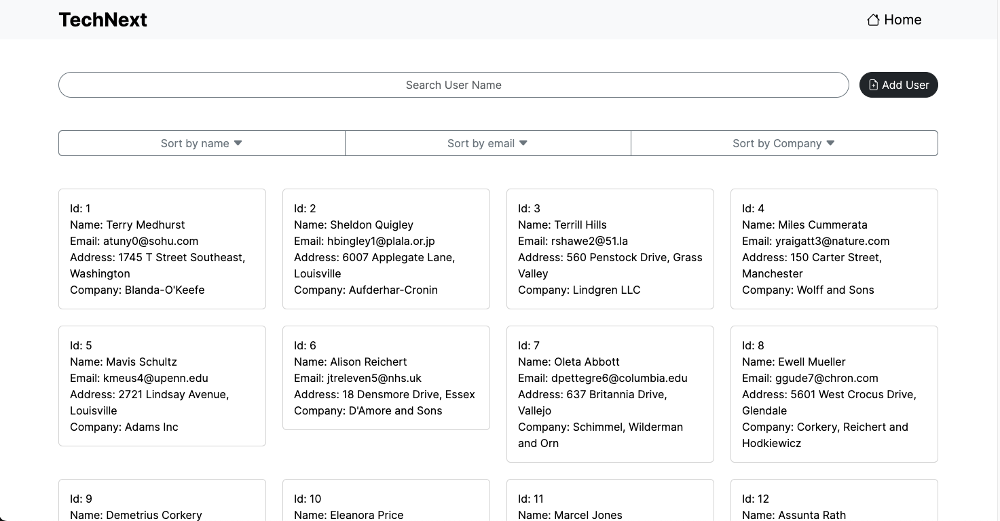
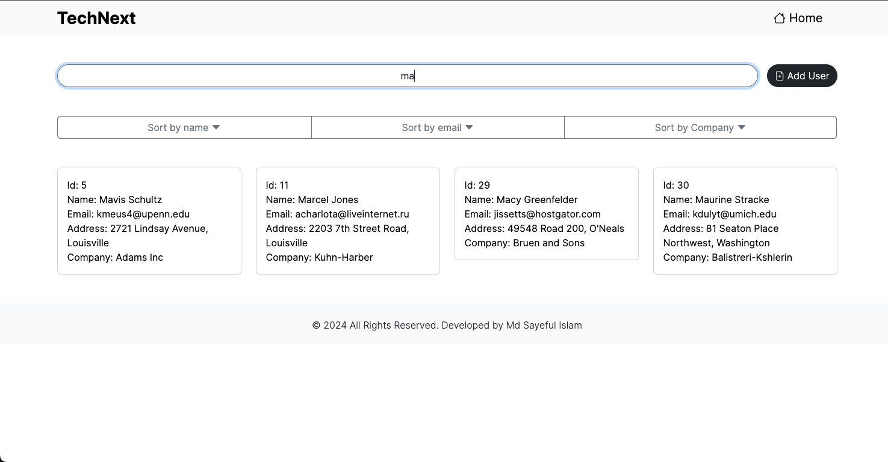
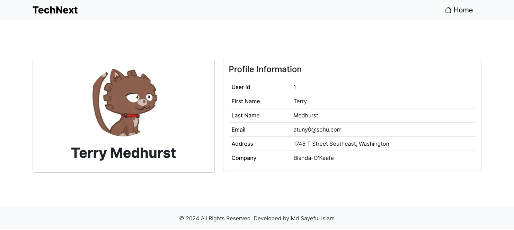
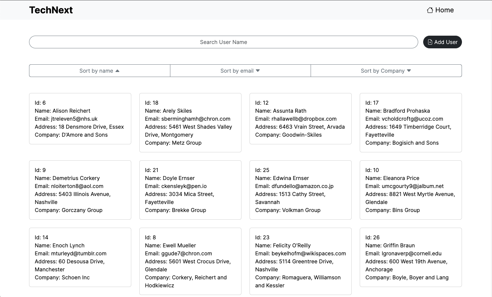
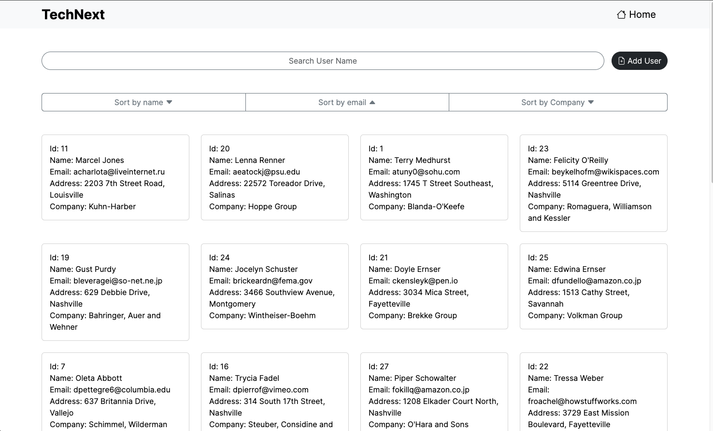
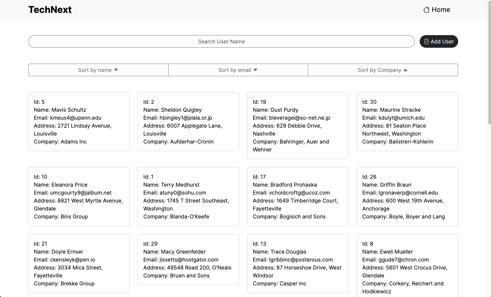
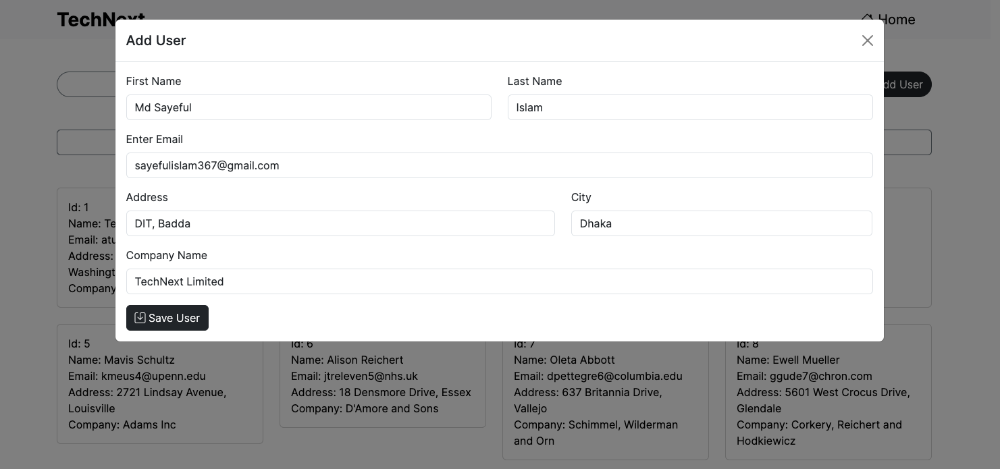
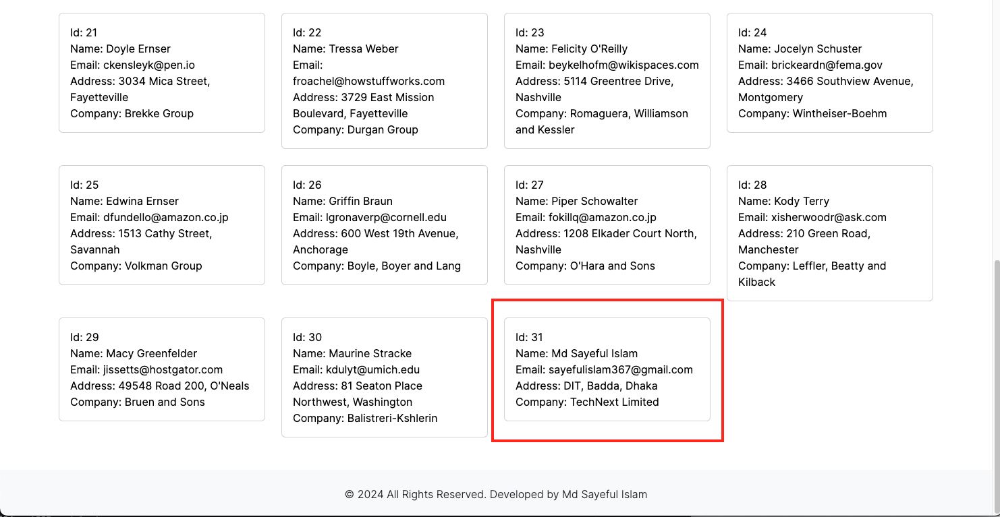

This is a responsive online Users Profile web app. I have built on a Frontend NextJs App Router.

This web app using dependencies are:
```bash
"bootstrap": "^5.3.0",
"bootstrap-icons": "^1.11.3",
```

Application functionality are:
- Display List all the users in a card layout as the page loads.
- Click on card, it will open a separate page and will show user details.
- Search based on the user's name.
- Sort the users name, email and Company name.
- Add form data main users list.
- responsive design large, laptop, tablet, mobile screen.

## Getting Started
Don't refresh the page.

1. First download the code and run:
```bash
npm install
```

2. Run the development server:
```bash
npm run dev
```

Open [http://localhost:3000](http://localhost:3000) with your browser to see the result.

## Users Profile App view
Main Home Page


Search Data


Click View Page


Sort by Name


Sort by Email


Sort by Company


Add user Form


User Data add main list
